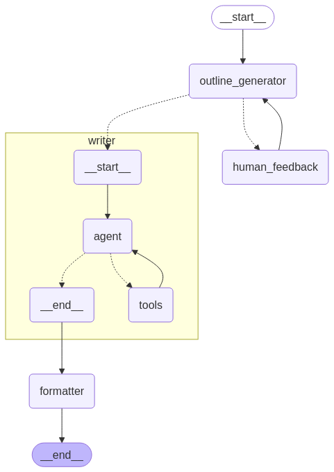

# LangGraph Deployment on AWS

This project demonstrates how to deploy a LangGraph-based agent workflow on AWS using serverless architecture. The solution leverages AWS AppSync, Lambda, SQS, and DynamoDB to create a scalable, event-driven architecture for AI agent workflows.

## Architecture Overview

The architecture consists of the following components:

- **AWS AppSync**: GraphQL API for client communication and real-time updates
- **AWS Lambda**: Serverless compute for the orchestrator and resolvers
- **Amazon SQS**: Message queue for asynchronous processing
- **Amazon DynamoDB**: Storage for workflow state and results
- **Amazon Bedrock**: Foundation model access for AI capabilities
- **React Frontend**: Web interface for interacting with the agent



## Project Structure

```
.
├── appsync_resolvers/       # AppSync resolver Lambda functions
├── orchestrator/            # LangGraph workflow orchestrator
│   ├── lambda_handler.py    # Lambda entry point
│   ├── workflow.py          # LangGraph workflow definition
│   ├── nodes.py             # Agent node implementations
│   └── prompts.py           # LLM prompts
├── frontend/                # React frontend application
├── template.yaml  # SAM template for AWS resources
└── schema.graphql           # GraphQL schema
```

## Prerequisites

- AWS Account with appropriate permissions
- AWS CLI configured with your credentials
- AWS SAM CLI installed
- Python 3.12
- Node.js and npm (for frontend)
- Bedrock model access configured in your AWS account

## Deployment Instructions

### 1. Clone the Repository

```bash
git clone <repository-url>
cd langgraph-deploymnet-aws
```

### 2. Configure Environment Variables

Create a `.env` file in the frontend directory (use `.env.example` as a template):

```bash
cd frontend
cp .env.example .env
# Edit .env with your configuration
cd ..
```

### 3. Deploy the Backend

Update `TAVILY_API_KEY` environment variable in template.yaml

Use AWS SAM to deploy the backend resources:

```bash
sam build
sam deploy --guided
```

During the guided deployment, you'll be prompted for:
- Stack name (e.g., langgraph-agent)
- AWS Region
- Parameter values (if any)
- Confirmation of IAM role creation
- Deployment options

Take note of the outputs after deployment, which include:
- GraphQL API Endpoint
- GraphQL API Key
- SQS Queue URL
- DynamoDB Table names

### 4. Update Frontend Configuration

Update the `.env` file in the frontend directory with the outputs from the SAM deployment:

```
REACT_APP_APPSYNC_URL=<GraphQLApiEndpoint>
REACT_APP_APPSYNC_API_KEY=<GraphQLApiKey>
REACT_APP_REGION=<YourRegion>
```

### 5. Deploy the Frontend

You can deploy the frontend to AWS Amplify, S3 static website hosting, or run it locally:

For local development:
```bash
cd frontend
npm install
npm start
```

For production build:
```bash
cd frontend
npm install
npm run build
# Deploy the build directory to your hosting service
```

## Usage

Once deployed, you can interact with the agent through:

1. The React frontend application
2. Direct GraphQL API calls to AppSync


## Cleanup

To delete the stack run:

```sam delete```

